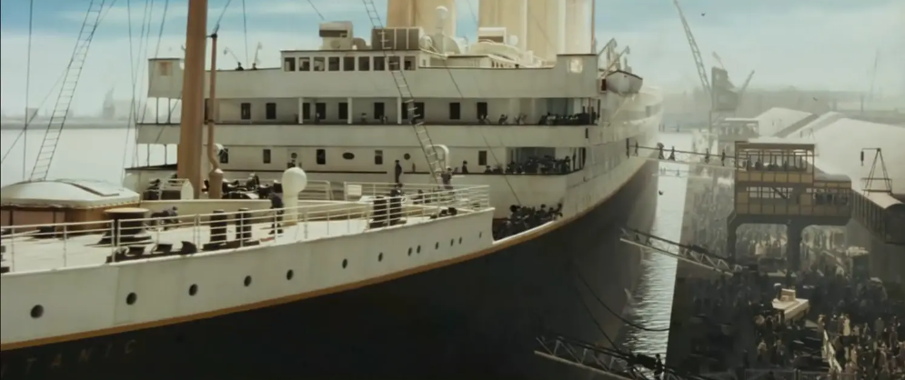
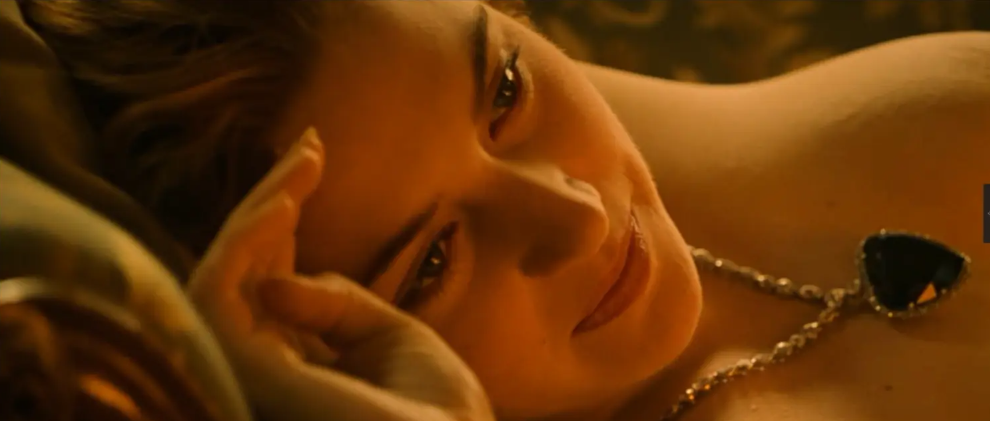
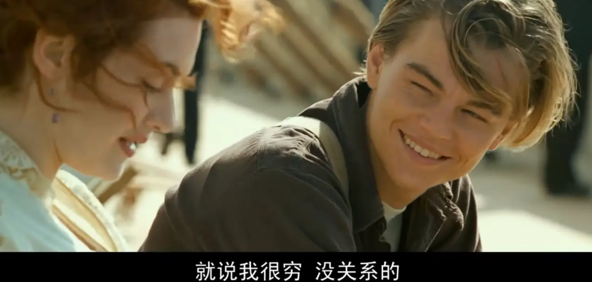
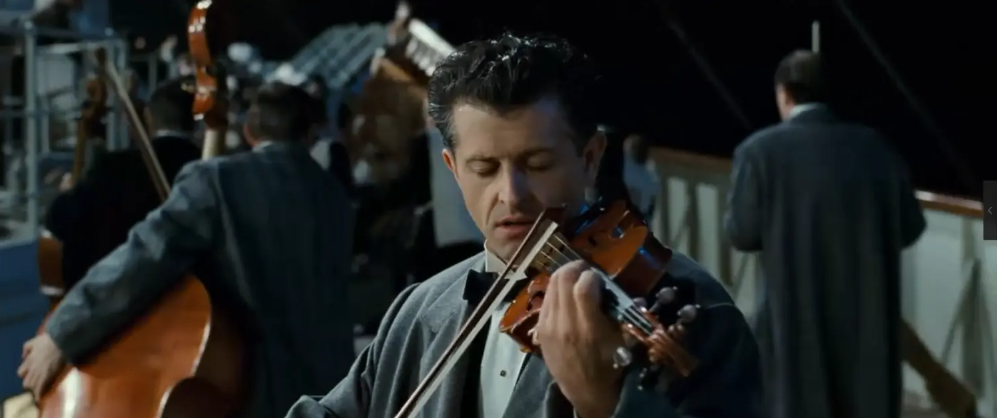
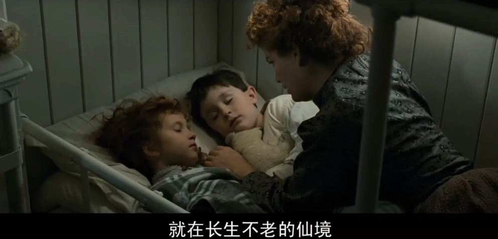
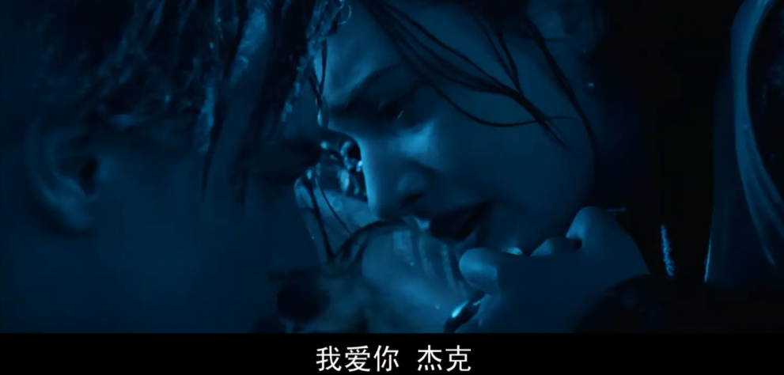
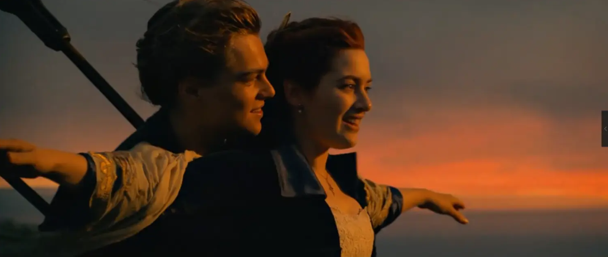

我是一个非常喜欢看电影的人，但同时，也是被电影折磨到不行的人。因为太喜欢，所以对电影的质量几乎到了偏执的地步，曽无数次在寂寥的晚上寻找能够引起我心灵碰撞的电影，但时常因为一无所获而感动痛苦不堪。实在找不到的时候，我偶尔会翻起心中自以为最经典，对我影响最大的作品来重温。而《泰坦尼克号》总会涌上心头，我已经忘记我是第几次看这部伟大的电影了，但每一次重看它，都会让我非常非常感动。

我记得我第一次看《泰坦尼克号》的时候才上五年级，那时候用的还是CD，需要三张才能把这部电影完整地收录下来，CD盒子上用的还是它的别名《铁达尼号》。记得当时我第一次在电影中见到一个Rose让Jack去绘画那一幕，脸红了一下，待家里把电影播放完后，深夜里还偷偷在电脑上重看了那一段。那时还小，并不懂Rose和Jack那一幕蕴涵着怎样的爱情，只是在我后面多次的重看的过程中，我便一点点地从各种各样的角度感受那一段的情感。

我一直都很喜欢画画，或许我更能理解一张亲手画出的画可以蕴涵的意义有多大。特别是在这个滤镜美图横飞的时代，一个真正懂你和欣赏你的人亲手为你画一张素描该是一件多么浪漫、美妙而珍贵的事。尽管我已经很久很久没画画了，但依然可以被Jack的第一条线条唤起心中对爱情最浪漫的憧憬。我特意截了一张Rose的图，我最喜欢她那双眼睛，既充满美丽又富有感情。顺便一提，里面的钢琴背景音乐非常好听，简简单单，当这一段音乐让我们联想到如此伟大的爱情时，也再无什么比这更让人享受的了。

当我越长大再去看这部片子的时候，我会慢慢地有更多的代入感。而在我面临求职，面临所谓的长大，车子，房子等这些话题时，Jack身上的潇洒和自由让我羡慕不已，我的处境就像Rose，只是比她穷上几百倍。

在今天，只有一个真正活得自在充实的人才能带着如此自然的微笑说出“就说我很穷，没关系的”。特别是在这个物欲横流的时代，每一个像我一样的年轻的男生或许心中都有一火炬，给予他无穷无尽的动力去追求财富。当然，我是其中一个。这其实是一件非常棒的事情，但与之同时，我只是非常希望自己无论未来有多累，都知道自己有喜欢的事，或者去打打球，去画画，弹弹琴，写写文章，读读书，找几个朋友聊聊天，我并不希望未来自己也能笑着说“我很穷”，但我希望未来自己可以笑着说“没关系，我很好”。

《泰坦尼克号》的高潮无疑是沉船那一段。在灾难和死亡面前，人性显得那么地冷酷，但又显得那么温暖。估计大多数的人们在这一段中就泪奔了。我经常因为不想看到里面的惨况而快进，一艘船，一次事故，就能把所有人都描绘了出来，我写几个我印象比较深刻又比较暖的角色吧。

在灾难面前，在劝走乐队的其他同伴后，默默地继续演奏，或许是出于绝望，或许是出于敬业，或许是出于对音乐的热爱。小提琴师超越生命的演奏姿态确实让人非常感动。他的同伴们在听到小提琴声后，纷纷转身走回来，一同与他完成最后的演奏。

在小提琴师的配乐下，镜头切换到另外一位角色身上，大概很多人对这位勇敢的母亲印象很深刻。估计不少女生在此刻就hold不住眼泪了。一位母亲在灾难面前讲故事哄儿女入眠，我不曾想过这位母亲的心情，煎熬？自责？怜爱？抑或是幸福？

这一幕，我只是贴出来。实在想不到合适的字句去描述了。一千个读者，就有一千个对这句对白的感悟。

用最经典的剧照来结束这篇文章。大四了，有时其实自己很累，挺过来全靠死撑着。不过，深夜能够这样静静地看一部电影，写一篇文章。嗯，挺好。