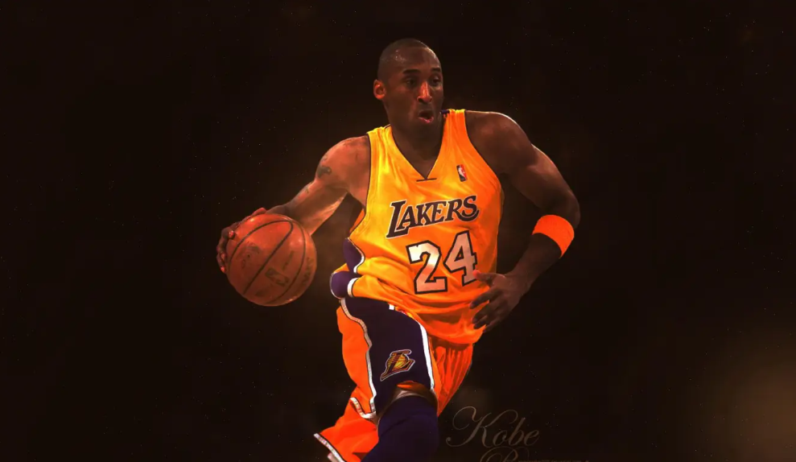
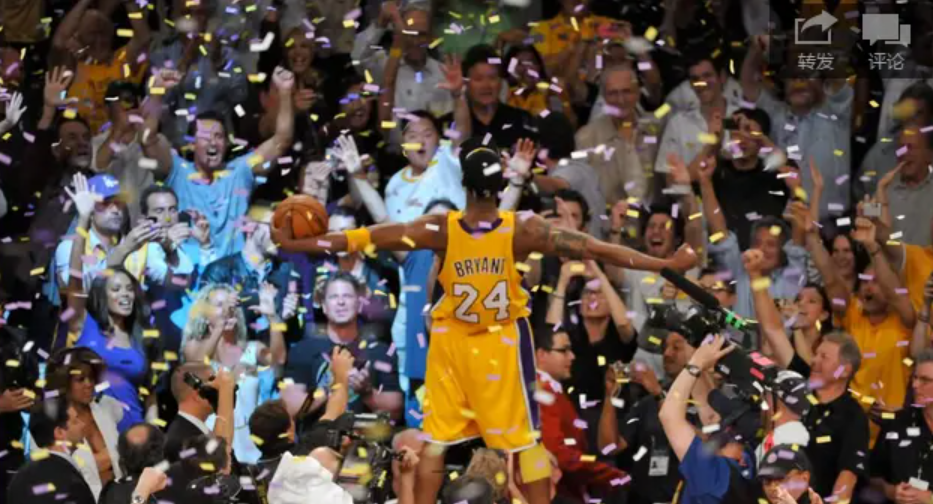

今天打开虎扑首页，匆匆看了一眼比赛。哎呀，骑士又要干掉老鹰了，詹姆斯那家伙又表现得那么好，难道他又要去总决赛，又要多拿一次冠军？老鹰你要加油啊！噢，对了，我就是一个詹黑。其实也不是故意黑他，我不得不承认詹姆斯是一个非常聪明又厉害的人物，有时候看他打球还是觉得挺过瘾的。之所以黑他，估计是自己是一个铁杆科密，黑詹黑哈登似乎与生驱来。可惜啊，今天在首页看到湖人的新闻——科比承认下个赛季将是他最后一个赛季。一知道这个消息，心理难免有些惋惜。

我忘记自己是什么时候喜欢上科比打球，印象比较深刻的一次是09年季后赛，湖人打火箭。看到科比咬着牙似乎要将火箭往死里打时，我觉得这个球员太TM帅了。那时候姚明还经历着伤病，麦迪已经陨落，NBA上詹姆斯和科比的对碰算是最精彩的了。科比的技术和态度深深地迷住了我，于是我就成了一个科密，与此同时就成为了一名詹黑。　

科比伴随了我整个高中。因为他，在篮球场上，对胜利变得非常地执着，那种不服输态度算是他赠与我的一份礼物，虽然有时候会困扰着我，但也确实给了我很多的动力，给了我很多的信心，让我完成很多自己以为完成不了的事。

今天的我在努力克制心中的求胜欲望，希望自己可以认输，希望自己可以变得低调，希望自己可以变得圆滑，希望自己能够谦卑，从而在广州——这个竞争激烈的地方谋得一席生存的位置。我似乎在和敌人妥协，不再高傲地对他进攻，不再认为自己可以战无不胜，我不知道这样想是一种“聪明”，还是一种“懦弱”，但有时候真希望自己可以再变得狂妄自大，至少我感觉会很爽，毕竟自己才二十多岁，没有什么是输不起的。NBA场上那个偏执于胜利的斗士宣布自己的最后一个赛季了，时间老人真的是挺无情的，任何人都会有一天为之宣布退役，但谁都希望有一个无悔的过程。

我突然再一次非常敬佩科比，我完全可以感受到：他全身心投入篮球这个世界，并且永不放弃地追求着他心中的荣耀。我一直都特别幸运自己可以如此疯狂地爱上一项体育活动，抱着篮球一个人在场上训练，我亲身地感受到付出与收获的道理，我亲身体验到精神力量如何驱动着我疲惫的身体，我也仿佛可以感受到——坚韧的意志如何带来奇迹。

我一直都认为，篮球场就是一个世界。有的人会和厉害的人合作，以此获得胜利；有点人会甘做孤单英雄，就算输也会竭尽全力；有的人会谦虚；有点人也会狂莽......今天的我不会对这些态度做任何的评价，我需要做的是好好记住自己的位置，记住自己在球场上的理念，为之偏执，为之狂莽。

> --致敬我的英雄，Kobe Bryant 记于第一次听到科比要退役。