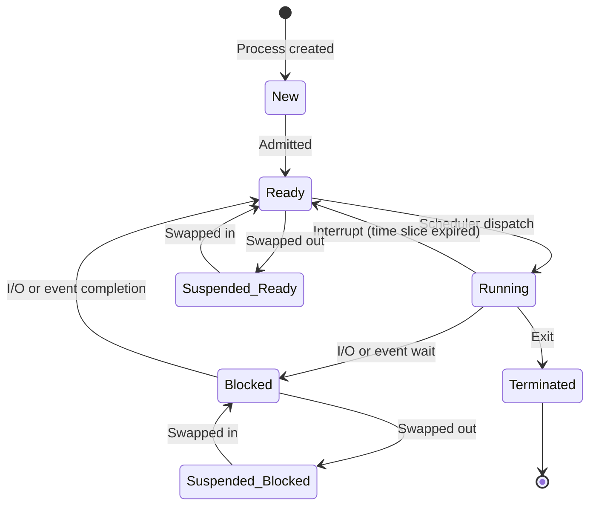

(文章由作者和 claude AI协作完成)

## 引言

在计算机科学领域，特别是操作系统的学习中，异常控制流（Exceptional Control Flow, ECF）和进程管理是两个至关重要的概念。本文将深入探讨这些主题，基于《深入理解计算机系统》（CSAPP）一书的内容，结合具体例子和详细解释，帮助读者全面理解这些核心概念。

编写这个博客的起源是因为有一天我跟同事讨论关于系统负载的问题。进程在运行过程中有一个状态叫不可中断状态，我以前以为不可中断状态中的进程是不会将CPU让出来的。因此认为我们只需要关注负载系统的负载，而不需要太关注CPU的消耗。事实上，我的理解是错的，**不可中断的进程**是会将CPU让出来的。因此，在压力测试的过程中。 CPU的消耗还是很重要的，而系统负载 load 代表的是系统CPU资源以及io资源的共同使用概况。

那中断对于操作系统来说是什么呢？计算机进程又如何基于中断来实现的？这就是本次博客需要讨论的内容。

## 1. 异常控制流（ECF）概述

异常控制流是指程序执行的突然改变，通常是由于某些特殊事件的发生。ECF是实现操作系统功能的基础机制，也是理解系统级编程的关键。

### 1.1 ECF的四种主要类型

1. **中断(Interrupts)**
   - 特点：异步，外部触发
   - 来源：I/O设备、定时器等
   - 处理后：返回到下一条指令
   - 例子：键盘输入、网络数据包到达

2. **陷阱(Traps)**
   - 特点：同步，有意的
   - 来源：特定指令触发
   - 处理后：返回到下一条指令
   - 例子：系统调用、断点指令

3. **故障(Faults)**
   - 特点：同步，可能可恢复
   - 来源：程序执行错误
   - 处理后：可能返回到触发指令重试
   - 例子：页面故障、除零错误

4. **终止(Aborts)**
   - 特点：同步或异步，不可恢复
   - 来源：严重硬件错误
   - 处理后：终止程序执行
   - 例子：硬件故障、严重系统错误

### 1.2 ECF在编程中的具体应用

1. **中断例子**:
   ```c
   while(1) {
       // 主循环
       if (keyboard_interrupt_received) {
           handle_user_input();
       }
   }
   ```

2. **陷阱例子**:
   ```c
   int fd = open("file.txt", O_RDONLY);  // 触发系统调用陷阱
   if (fd < 0) {
       perror("Error opening file");
       exit(1);
   }
   ```

3. **故障例子**:
   ```c
   int *ptr = NULL;
   *ptr = 5;  // 触发段错误(Segmentation Fault)
   ```

## 2. ECF作为进程抽象的工具

ECF是实现进程抽象的关键机制。它使操作系统能够:

1. **管理进程状态**：通过中断和异常切换进程执行。
2. **实现多任务**：利用定时器中断实现时间片轮转。
3. **提供系统调用**：通过陷阱实现用户态到内核态的转换。
4. **支持进程间通信**：利用信号机制。
5. **管理资源和保护**：处理非法操作和访问。
6. **实现虚拟内存**：通过页面故障管理内存。

## 3. 进程状态及转换

### 3.1 基本进程状态

1. 新建（New）
2. 就绪（Ready）
3. 运行（Running）
4. 阻塞（Blocked）或等待（Waiting）
5. 终止（Terminated）

部分系统还包括：
6. 挂起就绪（Suspended Ready）
7. 挂起阻塞（Suspended Blocked）

### 3.2 进程状态转换图



### 3.3 触发状态转换的中断类型

1. **时钟中断**
   - 转换：Running → Ready
   - 原因：进程时间片用尽

2. **I/O 中断**
   - 转换：Blocked → Ready
   - 原因：I/O操作完成

3. **系统调用中断**
   - 转换：Running → Blocked （如等待输入）
   - 转换：Running → Terminated （如exit()调用）

4. **页面错误中断**
   - 转换：Running → Blocked
   - 原因：访问不在内存中的页面

5. **硬件故障中断**
   - 转换：Running → Terminated
   - 原因：严重硬件错误

6. **调试中断**
   - 转换：Running → Blocked
   - 原因：触发断点

7. **电源管理中断**
   - 转换：Running/Ready → Suspended
   - 原因：系统进入低功耗模式

8. **用户定义的信号**
   - 转换：Running → Terminated （如SIGKILL）
   - 转换：Running → Blocked （某些信号导致暂停）

## 结论

理解异常控制流和进程状态管理对于深入掌握操作系统原理至关重要。这些机制使操作系统能够有效管理和协调多个进程，实现多任务处理和资源管理。通过ECF，操作系统为每个进程提供了一个看似独占系统资源的环境，尽管实际上多个进程在共享硬件资源。

这种抽象不仅简化了程序员的工作，使其能够专注于高层次的软件设计，而且也为现代操作系统的高效运行提供了基础。深入理解这些概念对于系统级编程、操作系统设计，以及解决复杂的并发和资源管理问题都有重要意义。
